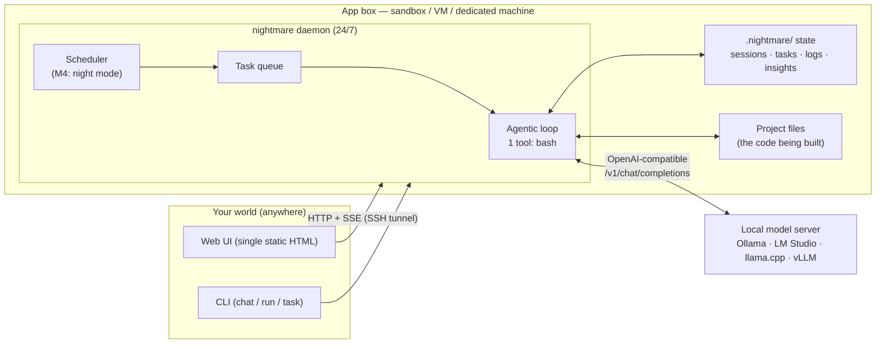
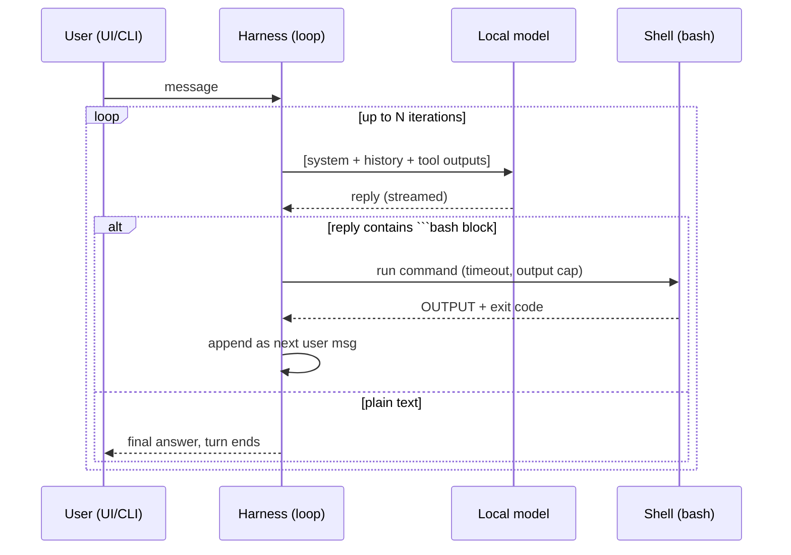
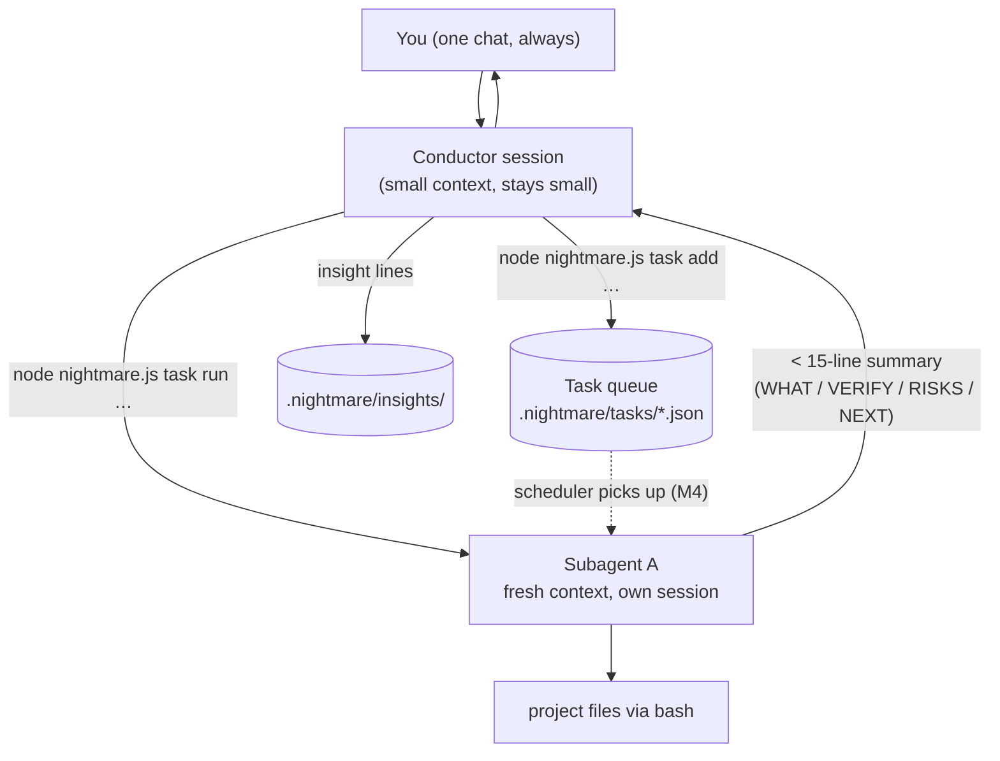

# Nightmare — Architecture

**A minimal, sovereign agentic harness for local AI.** One chat interface, running 24/7, that does all the work in subagents on your own hardware — building overnight while you sleep, and surfacing insights in the morning.

Status: v0.1 (M0–M1 shipped). Last updated: 2026-02-15.

---

## 1. Design tenets (the opinion)

1. **Context is the budget.** Every token in the prompt competes with every other token. We never pay for capability we don't use this turn: minimal system prompt (~100 tokens), checklists read just-in-time via bash, subagents get fresh contexts, and session history is compacted before it bloats.
2. **One tool is enough: bash.** `cat`, `sed`, `git`, `npm test` — bash subsumes every other tool we'd add, it's universally available, and it's trivially auditable. Adding structured read/write/edit tools later is possible, but they're sugar, not foundation.
3. **Model-agnostic text protocol, not native tool calls.** Weak local models mangle structured tool-call formats. So the protocol is plain text: the model emits a fenced ` ```bash ` block, the harness runs it, and returns `OUTPUT:` + exit code. Works on any OpenAI-compatible endpoint, survives small models, and is human-readable in logs.
4. **Files are memory.** Sessions, tasks, logs, insights, checklists — all plain files in `.nightmare/` (plus `checklists/` in the repo). If it matters, it's in a file you can `less`, diff, and back up. No database, no lock-in.
5. **The interface is decoupled from the app.** The daemon owns the brain; the UI is a static web page that talks to it over HTTP/SSE. Run the app in a VM, chat from your laptop (or phone) over an SSH tunnel. The UI can be replaced, killed, or opened on ten screens without touching the agent.
6. **Conductor + subagents.** The chat session is a thin conductor: it decomposes, delegates, verifies, and reports. Heavy work runs in subagents — each a fresh `nightmare` process with its own clean context. Only summaries flow back. The conductor's context stays small forever.
7. **Dark factory.** A queue + scheduler turns idle time into production: overnight jobs run queued tasks and maintenance on free local tokens, file insights, and produce a morning digest. You focus on ideas and features; it does the rest.
8. **Containment is the sandbox.** No fake permission prompts. The app lives where you want the blast radius to be (a VM, a container, a dedicated machine), and logs every command. Sovereignty: no telemetry, no cloud, no dependency supply chain — one file, zero npm packages.

---

## 2. Topology



ASCII fallback:

```
 [browser / CLI]  ──SSH tunnel / local──▶  nightmare daemon (24/7)
                                                │  │
        OpenAI-compatible API ◀────────────────┤  │
        (Ollama / LM Studio / llama.cpp /      │  │
         vLLM — local model, free tokens)      │  │
                                                ▼  ▼
                              .nightmare/ state + project files
                              (bash is the only door in)
```

Two deployment shapes:

- **Same machine** — app and model side by side. Simplest; default.
- **App in a VM/container, chat from outside** — daemon binds to 127.0.0.1 inside the VM; you open the UI via `ssh -N -L 8686:127.0.0.1:8686 user@vm`. Nothing is exposed; the VM *is* the sandbox.

---

## 3. The core loop



Guardrails (the difference between "agent" and "runaway script"):

| Guardrail | Default | Why |
|---|---|---|
| Max iterations per turn | 30 | caps runaway agentic loops |
| Command timeout | 5 min | one hung build can't eat the night |
| Output cap per command | 8 KB into context | keeps context lean; full log stays on disk |
| Identical-command detector | 3× same command → stop | local models do infinite retry loops; this kills them |
| Empty-response retries | 2 nudge, then stop | small models occasionally emit nothing |
| Context compaction | at ~60 KB of history (~15k tok) | auto-summarizes the session to keep a small context alive |

---

## 4. The wire protocol (model-agnostic)

**System prompt (verbatim, ~100 tokens):**

> You are a focused agent on the user's own machine, powered by a local model. One tool: bash.
> To run a command, reply with a single fenced block:
> \```bash
> command
> \```
> Then stop. The next message starts with "OUTPUT:" and ends with the exit code.
> Chain as many command turns as needed. When done, give the final answer in plain text with no bash block.
> Be terse. Limit output (head -50, grep -m 20, tail). Never cat files over ~200 lines.
> Before coding/debugging work, read the matching checklist first: ls checklists/ && cat checklists/coding.md

**Tool call:** exactly one fenced ```bash / ```sh / ```shell block per reply.
**Tool result:** user-role message: `OUTPUT:\n<result>\nEXIT:<code>` (with `(TIMED OUT)` marker if killed).

Why not native structured tool calls? Three reasons: (1) small/quantized models frequently emit malformed JSON tool calls, which native handling then fails on; (2) text fences work on *any* OpenAI-compatible endpoint, including ones that don't implement tools at all; (3) the whole transcript stays human-readable — you can read an entire agent session with `cat` and understand every decision. Native tool-call mode is on the extension list (M6) as a per-model profile option, not the foundation.

---

## 5. Context budget

The scarce resource in local AI isn't tokens (free) — it's *context window quality*. Models degrade hard as the window fills, so we budget aggressively:

| Component | Budget | Notes |
|---|---|---|
| System prompt | ~0.3k tokens | constant, tiny, non-negotiable |
| Active session | ~15k tokens | auto-compacted at ~60 KB chars (~15k tok est.) |
| After compaction | ~1k brief + last 4 msgs | goal, state, open items, file paths survive |
| Each tool output | ≤ 2k tokens (8 KB) | the model must ask for what it needs; logs keep the full record |
| Checklists | 0 in prompt; ~0.3k when read | just-in-time via `cat checklists/x.md` |

Consequences: comfortable on a 16k-context model, excellent on 32k+. The compaction threshold (`contextWarnChars`) is per-model in config — a 32k model gets more headroom than an 8k one.

---

## 6. State & memory (files, not a database)

```
.nightmare/              # runtime state — gitignored, back up = copy folder
├── config.json          # endpoint, model, temperature, limits, host/port, token
├── sessions/            # *.json — full message history, one file per session
├── tasks/               # *.json — subagent work items (see §7)
└── logs/                # agent.log — one JSON line per event (turns, tool calls, errors)

checklists/              # just-in-time knowledge, lives with the repo
├── coding.md            # read before non-trivial code work
├── debug.md             # read when something is broken
└── task.md              # subagent finish contract (summary format)
```

Memory model: the model's *working* memory is the session; the *long-term* memory is files. The conductor can read/write `.nightmare/` and project files with bash, so "remember this" = "write it to a file." No hidden state anywhere.

---

## 7. Conductor & subagents (M2)

The chat session is the **conductor**. It doesn't do heavy lifting itself; it delegates:



Rules:

- **One conversation, forever.** You never talk to subagents directly. The conductor decomposes, verifies summaries, and reports back. This keeps your mental model trivial and your context clean.
- **Subagent = re-entry.** A subagent is just `nightmare run` / `task run` with a fresh session and the task prompt. No second runtime, no SDK, no API between them — a process, a session file, a bash tool.
- **Summary contract** (checklists/task.md): every subagent ends with WHAT changed (paths), HOW verified (command + result), RISKS, NEXT. Only that summary returns to the conductor.
- **Serial by default.** One local model = one job at a time. The queue is FIFO; determinism > speed. (Parallel subagents against multiple model servers is an M6+ idea.)
- **Task file** carries the whole lifecycle: `{id, title, prompt, status: queued→running→done|failed, result, timestamps}`. Crash-safe: a task stuck in `running` after a restart is re-queueable.

---

## 8. Dark factory (M4)

Night = free compute. The daemon already runs 24/7; the scheduler turns it into a factory.

- **Tick:** every 60s the scheduler checks: PAUSE file? night window open? tasks queued? model idle?
- **Modes:** `idle` (work queued tasks whenever nothing else is running — the default) or `night window` (e.g. 23:00–07:00, for when you want it to *only* build overnight).
- **Job types:**
  - *tasks* — from the queue (M2), each run in a fresh subagent session.
  - *maintenance* — configured recurring jobs: "run test suite, fix failures, commit", "git pull + run tests", "update this dependency".
  - *digest* — at a set time: compile overnight `.nightmare/insights/` lines + task results into `.nightmare/digest/YYYY-MM-DD.md` and push a chat ping: "Overnight: 3 tasks done, 2 fixes, 1 open question — see digest."
- **Insights:** any subagent that finds something interesting (a pattern, a bug, an idea, a better approach) appends one line to `insights/inbox.md` — cheap, structured, no context cost. The digest curates them. This is how the factory "raises insights to you" while you sleep.
- **Pause switch:** `touch .nightmare/PAUSE` stops all scheduled work instantly; chat keeps working. `rm` it to resume. One file, no config fiddling, works from any terminal.

Overnight example:

```
23:00  you: "Tonight: finish the task-queue UI, then run the test suite and fix anything red."
       → conductor creates 2 tasks, queues them
23:01  scheduler → subagent runs task 1 (fresh context, coding checklist)
00:40  task 1 done → summary filed, insight: "SSE reconnect logic duplicated in UI + daemon — extract?"
00:41  scheduler → subagent runs task 2 (tests, debug checklist)
02:15  2 failures → fixed, committed, result filed
07:00  digest written + chat ping lands
07:02  you: read 20 lines of digest, approve the follow-up idea, back to your day
```

---

## 9. Decoupled interface (bridge + UI)

The daemon exposes a tiny HTTP API; the UI is one static HTML file with zero build step.

| Endpoint | Method | Purpose |
|---|---|---|
| `/` | GET | serves the UI |
| `/health` | GET | model, busy, queue depth, session, task counts |
| `/session` | GET | current live session's recent messages |
| `/events` | GET | SSE stream: deltas, tool calls/results, state, errors, task events |
| `/chat` | POST | `{text}` → enqueue for the main session (FIFO, serial) |
| `/new` | POST | start a fresh session |
| `/compact` | POST | force-compaction of the live session |
| `/tasks` | GET / POST | list / create tasks |

- **SSE, not WebSockets:** one-directional event stream + POST for input covers everything, needs zero dependencies, and tunnels cleanly over SSH (a plain TCP port).
- **Auth:** optional shared token in config. When set, all endpoints (except `/health`) require `Authorization: Bearer` / `?token=`. The UI prompts once and remembers per browser session.
- **Decoupling guarantees:** the daemon is the only long-lived process; the UI is stateless (everything is re-fetchable: `/session` + `/events`); multiple UIs can attach; the UI can live on any device, in any OS, even on a phone.

---

## 10. Failure modes of local models (and the mitigation)

| Failure mode | Mitigation |
|---|---|
| Malformed / missing tool-call syntax | text protocol (fenced blocks) — degrade gracefully, never parse JSON the model invented |
| Infinite retry loops | identical-command detector (3× → hard stop) + iteration cap |
| Runaway generation (no stop) | `max_tokens` per model profile; command timeout; iteration cap |
| Context overflow / quality cliff | auto-compaction at a per-model threshold; small system prompt; output caps |
| Empty responses | nudge + retry (2×), then stop with a visible error |
| Server crashes mid-turn | error surfaced in chat; session saved after every step → resume with "continue" |
| Slow inference (30 tok/s…) | patience by design: streaming UI, serial queue, overnight window for heavy work |
| Model hallucinates success | subagent summary contract forces a VERIFY section (command + result) |

---

## 11. Repository layout

```
localharness/
├── nightmare.js          # the whole app (M0–M4 target: one file, zero deps)
├── package.json          # name/version/bin only — no dependencies
├── ui/index.html         # the decoupled web UI (single file, no build)
├── checklists/           # just-in-time knowledge (coding, debug, task)
├── docs/
│   ├── ARCHITECTURE.md   # this file
│   ├── MILESTONES.md     # the plan
│   └── QUESTIONS.md      # open questions + suggestions (your feedback)
├── test/mock/server.js   # offline mock OpenAI-compatible server
└── .nightmare/           # runtime state (gitignored)
```

---

## 12. Decisions log

| # | Decision | Rationale |
|---|---|---|
| D1 | Node 18+, zero npm dependencies | sovereign supply chain; auditable; the model can safely edit its own harness; runs anywhere node runs |
| D2 | Text-fenced bash protocol over native tool calls | weak-model robustness; any OpenAI-compatible server; human-readable transcripts |
| D3 | bash as the only tool | universal, auditable, sandboxable; structured tools are sugar, not foundation |
| D4 | SSE + static UI over WebSockets/native apps | zero-dep, tunnels over a single TCP port, trivially replaceable |
| D5 | Plain files over a database | inspectable with `less`, diffable, back up = copy; no engine to maintain |
| D6 | Per-project `.nightmare/` state dir | each project folder is self-contained; multiple daemons = multiple project boxes |
| D7 | Serial task execution | one local model; determinism beats speed; parallelism revisited in M6+ |
| D8 | Single-file app until M5 | one file the model can read/modify/reason about end-to-end; split only when it hurts |
